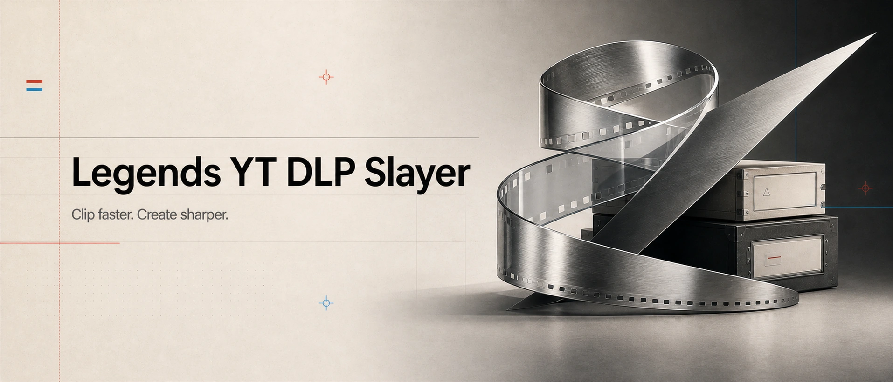

# Legends YT-DLP



[](LICENSE)


Clip faster. Create sharper.

Windows-first creator control plane for repeatable source pulls, local verification, transcripts, search, and clip-building on top of `yt-dlp`, with optional Mullvad VPN guardrails.

Legends YT-DLP exists because raw `yt-dlp` is powerful, but real creator work needs more than a one-off command. The project wraps the official `yt-dlp` binary with explicit batch plans, optional source notes, local state, conservative defaults, a short use notice before real runs, default pacing between pulls, and an opt-in Mullvad VPN mode for guarded runs. Ripping a video from time to time is frictionless; bulk pulls slow down and ask for acknowledgement.

## What It Does

- Supports the official Mullvad CLI as an opt-in guarded-run layer (`--with-vpn`); nothing requires Mullvad by default.
- Stores the Mullvad account number locally in an ignored `.env` file (only needed for VPN-guarded runs).
- Downloads the official Windows `yt-dlp.exe` release from `yt-dlp/yt-dlp`.
- Verifies the downloaded binary against upstream `SHA2-256SUMS`.
- Detects `ffmpeg`.
- Detects a JavaScript runtime for modern YouTube extraction.
- Creates batch manifests with optional rights notes and evidence files.
- Inventories channel and playlist URLs into a reviewable item ledger before downloads.
- Copies optional rights evidence files into the batch folder.
- Provides a one-command setup path for Mullvad safety posture (`setup production`).
- In `--with-vpn` mode, requires Mullvad connected with Lockdown on, recovers the tunnel on network failures, then disables Lockdown and disconnects after completed real runs.
- Supports custom operator-provided smoke URLs for install validation.
- Supports bounded smoke jobs with max downloads, height, and filesize limits.
- Generates stable anonymous-mode `yt-dlp` config files with download archives and conservative retry/sleep settings.
- Blocks real runs until preflight passes.
- Requires an explicit `--yes` flag for real downloads.
- Paces pulls by default and requires `--bulk` acknowledgement for batches over 50 URLs.
- Verifies completed batches with archive, report, info JSON, media count, and ffprobe checks.
- Runs the ready-made CrispASR Parakeet backend against verified local media.
- Imports timestamped word ledgers for verified local media.
- Searches exact words and phrases across local transcripts.
- Generates reviewable FFmpeg clip plans and optional montages.
- Builds Obsidian-compatible transcript vault pages.

## Why It Exists

Creator projects fail in predictable places: messy source lists, duplicate pulls, broken resumes, unclear output folders, missing transcripts, and clips that are hard to find again. Legends YT-DLP turns those weak points into a repeatable plan, pull, verify, search, and cut flow.

The goal is not to evade platform controls. The goal is to make source capture deliberate, resumable, and useful for editing, research, and review.

## Current Status

Public beta.

Working now:

- `doctor`
- `setup production`
- Mullvad status/login/connect/lockdown wrappers
- Mullvad inspect and settings wrappers
- Mullvad safe recovery for tunnel/network failures
- Mullvad post-run shutdown that turns Lockdown off, disconnects, and verifies the final state
- guarded Mullvad disconnect testing that reconnects before returning
- VPN posture checks for Mullvad Lockdown, split tunneling, LAN sharing, and auto-connect (`--with-vpn`)
- anonymous yt-dlp auth/cookie policy checks
- JavaScript runtime detection/configuration for YouTube extraction
- bounded batch limits for smoke tests and controlled archive jobs
- official `yt-dlp.exe` install, update, upstream version check, checksum verification, and 90-day freshness check
- custom smoke-pack planning
- batch `plan`
- channel/playlist `inventory`
- multi-URL and URL-file batch planning
- batch `catalog`
- item `ledger`
- batch `preflight`
- guarded `run`
- batch `verify`
- post-capture `intelligence` workspace, CrispASR/Parakeet transcription, word import, search, clip planning, rendering, and vault export
- Codex skill suite under `skills/legends-yt-dlp`

Latest release: `v0.3.1`.

## Quick Start

From the project root:

```powershell
powershell -ExecutionPolicy Bypass -File scripts\legends-yt-dlp.ps1 onboard
powershell -ExecutionPolicy Bypass -File scripts\legends-yt-dlp.ps1 yt-dlp update
powershell -ExecutionPolicy Bypass -File scripts\legends-yt-dlp.ps1 yt-dlp version
powershell -ExecutionPolicy Bypass -File scripts\legends-yt-dlp.ps1 doctor
```

Optional: VPN-guarded runs with Mullvad. Nothing above needs it. When you want
guarded runs, set up Mullvad once, then pass `--with-vpn` to `plan`,
`preflight`, and `run`:

```powershell
powershell -ExecutionPolicy Bypass -File scripts\legends-yt-dlp.ps1 onboard --with-vpn
powershell -ExecutionPolicy Bypass -File scripts\legends-yt-dlp.ps1 setup production
powershell -ExecutionPolicy Bypass -File scripts\legends-yt-dlp.ps1 mullvad status --verbose
powershell -ExecutionPolicy Bypass -File scripts\legends-yt-dlp.ps1 mullvad inspect
powershell -ExecutionPolicy Bypass -File scripts\legends-yt-dlp.ps1 mullvad login
powershell -ExecutionPolicy Bypass -File scripts\legends-yt-dlp.ps1 mullvad lockdown on
powershell -ExecutionPolicy Bypass -File scripts\legends-yt-dlp.ps1 mullvad connect
powershell -ExecutionPolicy Bypass -File scripts\legends-yt-dlp.ps1 mullvad recover
powershell -ExecutionPolicy Bypass -File scripts\legends-yt-dlp.ps1 mullvad shutdown
powershell -ExecutionPolicy Bypass -File scripts\legends-yt-dlp.ps1 mullvad disconnect-test --emergency-unlock
powershell -ExecutionPolicy Bypass -File scripts\legends-yt-dlp.ps1 doctor --require-connected
powershell -ExecutionPolicy Bypass -File scripts\legends-yt-dlp.ps1 doctor --production
```

Validate the install with a small authorized smoke URL:

```powershell
powershell -ExecutionPolicy Bypass -File scripts\legends-yt-dlp.ps1 smoke plan --url "https://www.youtube.com/watch?v=..." --name "first-smoke"
powershell -ExecutionPolicy Bypass -File scripts\legends-yt-dlp.ps1 preflight "batches\...\manifest.json"
powershell -ExecutionPolicy Bypass -File scripts\legends-yt-dlp.ps1 run "batches\...\manifest.json" --dry-run
powershell -ExecutionPolicy Bypass -File scripts\legends-yt-dlp.ps1 run "batches\...\manifest.json" --yes
powershell -ExecutionPolicy Bypass -File scripts\legends-yt-dlp.ps1 verify "batches\...\manifest.json"
```

In `--with-vpn` mode, `run --yes` shuts Mullvad down after the batch reaches a terminal state: Lockdown is turned off first, Mullvad disconnects with `--wait`, and the final disconnected state is verified. Use `--keep-vpn` only when the operator intentionally wants Mullvad and Lockdown left running after the batch.

Create a batch:

```powershell
powershell -ExecutionPolicy Bypass -File scripts\legends-yt-dlp.ps1 plan "https://www.youtube.com/@CHANNEL" --name "channel-name"
powershell -ExecutionPolicy Bypass -File scripts\legends-yt-dlp.ps1 plan --from-file ".\urls.txt" --name "catalog-name"
powershell -ExecutionPolicy Bypass -File scripts\legends-yt-dlp.ps1 plan --from-file ".\urls.txt" --rights "optional permission/license/fair-use note" --rights-file ".\rights-evidence.md" --name "catalog-name"
powershell -ExecutionPolicy Bypass -File scripts\legends-yt-dlp.ps1 plan --from-file ".\urls.txt" --name "catalog-name" --folder-policy batch
powershell -ExecutionPolicy Bypass -File scripts\legends-yt-dlp.ps1 catalog
```

Folder policy controls output layout. `auto` puts direct multi-link plans into one named batch folder and keeps inventoried channel/playlist work grouped by uploader. Use `--folder-policy batch` for mixed one-off links, `--folder-policy by-uploader` for channel/archive work, and `--folder-policy flat` only when the selected output folder already represents the job.

For channel or playlist work, inventory first:

```powershell
powershell -ExecutionPolicy Bypass -File scripts\legends-yt-dlp.ps1 inventory "https://www.youtube.com/@CHANNEL" --rights-file ".\rights-evidence.md" --name "channel-name"
powershell -ExecutionPolicy Bypass -File scripts\legends-yt-dlp.ps1 ledger "batches\...\manifest.json"
```

Inventory creates the batch manifest, `urls.txt`, `yt-dlp.conf`, and `items.jsonl` without downloading media. Review the ledger with the user before a real run.

Preflight and run:

```powershell
powershell -ExecutionPolicy Bypass -File scripts\legends-yt-dlp.ps1 preflight "batches\...\manifest.json"
powershell -ExecutionPolicy Bypass -File scripts\legends-yt-dlp.ps1 run "batches\...\manifest.json" --dry-run
powershell -ExecutionPolicy Bypass -File scripts\legends-yt-dlp.ps1 run "batches\...\manifest.json" --yes
powershell -ExecutionPolicy Bypass -File scripts\legends-yt-dlp.ps1 verify "batches\...\manifest.json"
powershell -ExecutionPolicy Bypass -File scripts\legends-yt-dlp.ps1 ledger "batches\...\manifest.json" --refresh
```

Analyze verified local media after download when the user asks for transcripts, search, clips, a transcript vault, or when the job clearly calls for post-capture analysis. Plain archive/download jobs do not need transcription by default:

```powershell
powershell -ExecutionPolicy Bypass -File scripts\legends-yt-dlp.ps1 intelligence init "batches\...\manifest.json"
powershell -ExecutionPolicy Bypass -File scripts\legends-yt-dlp.ps1 intelligence doctor "batches\...\manifest.json" --require-gpu
powershell -ExecutionPolicy Bypass -File scripts\legends-yt-dlp.ps1 intelligence transcribe "batches\...\manifest.json" --media ".\video.mp4" --video-id "VIDEO_ID" --model auto
powershell -ExecutionPolicy Bypass -File scripts\legends-yt-dlp.ps1 intelligence transcribe "batches\...\manifest.json" --all --model auto --gpu-backend cuda --require-gpu
powershell -ExecutionPolicy Bypass -File scripts\legends-yt-dlp.ps1 intelligence ingest-words "batches\...\manifest.json" --input ".\examples\intelligence-words.jsonl" --video-id "VIDEO_ID"
powershell -ExecutionPolicy Bypass -File scripts\legends-yt-dlp.ps1 intelligence align nfa "batches\...\manifest.json" --media ".\video.mp4" --video-id "VIDEO_ID" --prepare-only
powershell -ExecutionPolicy Bypass -File scripts\legends-yt-dlp.ps1 intelligence search "batches\...\manifest.json" "agentic workflow"
powershell -ExecutionPolicy Bypass -File scripts\legends-yt-dlp.ps1 intelligence clips plan "batches\...\manifest.json" --query "agentic workflow"
powershell -ExecutionPolicy Bypass -File scripts\legends-yt-dlp.ps1 intelligence vault build "batches\...\manifest.json"
```

`intelligence doctor --require-gpu` is the truth gate for GPU-backed Parakeet. CPU-only CrispASR still runs locally without Codex or Claude token spend, but the project does not label that install GPU-ready unless CrispASR diagnostics report a compiled GPU backend.

`intelligence align nfa` prepares and imports NVIDIA NeMo Forced Aligner word CTM output for delicate clip boundaries. It expects NeMo/PyTorch/model weights in an external operator-managed environment; the core package only writes manifests and refines the word ledger.

Treat `legends-yt-dlp intelligence` as an optional post-capture layer. The normal archive contract ends after run, verify, and ledger review unless the user requested analysis or the operator has a clear reason to propose it.

## Safety Boundary

Allowed:

- archiving videos you own
- archiving videos you have permission to download
- archiving public-domain or appropriately licensed content
- using Mullvad as a privacy and leak-prevention layer while source capture is actively running
- stopping on throttling, captcha, login, or block signals
- keeping pulls modest; batches over 50 URLs require explicit `--bulk` acknowledgement

Not allowed:

- bypassing DRM, paywalls, captchas, login challenges, account controls, or access controls
- rotating VPN relays to continue through throttles, captchas, login prompts, account controls, or platform blocks
- using Legends YT-DLP for unlawful downloads
- hiding abusive or copyright-infringing use

See [docs/SAFETY.md](docs/SAFETY.md).

## Architecture

```text
Operator command
  -> CLI control plane
  -> Policy checks
  -> Optional Mullvad guard
  -> yt-dlp runner
  -> Batch state and reports
```

The project uses `yt-dlp` as an external child-process dependency rather than reimplementing download logic.

See [docs/ARCHITECTURE.md](docs/ARCHITECTURE.md).

## Agent Routing

Legends YT-DLP is markdown-first: an agent reads `skills/legends-yt-dlp/SKILL.md`
and the docs below to operate the CLI. No skill installation is required to
start; `cto-legends` routes capture goals here and hands over this README plus
the skill. Human operators use the same commands through `scripts/legends-yt-dlp.ps1`.

## Transcription Routes

Capture and transcription are separate concerns. This module transcribes its own
verified media through an external CrispASR executable (Parakeet-capable, never
bundled). For heavier transcription work, route outward instead of bulking up:
continuous background audio and voice sketchpads belong to
`legends-ambient-intelligence`, and live typing belongs to `hyperyap`.
See [docs/TRANSCRIPTION.md](docs/TRANSCRIPTION.md).

## Empire Vault

`intelligence vault build` exports Obsidian-compatible transcript pages that
slot into a Legends Empire vault as cited evidence. See
[docs/VAULT-MAP.md](docs/VAULT-MAP.md) for the page layout and the Empire-side
mapping.

## Documentation

- [CLI Commands](docs/CLI.md)
- [First-Run Walkthrough](docs/WALKTHROUGH.md)
- [Standard Operating Procedure](docs/SOP.md)
- [Architecture](docs/ARCHITECTURE.md)
- [Post-Capture Intelligence](docs/INTELLIGENCE.md)
- [Transcription Routes](docs/TRANSCRIPTION.md)
- [Empire Vault Map](docs/VAULT-MAP.md)
- [Safety and Use Policy](docs/SAFETY.md)
- [Legal and Attribution Notes](docs/LEGAL.md)
- [Alpha Packaging](docs/PACKAGING.md)
- [Changelog](CHANGELOG.md)
- [Codex Skill Suite](skills/legends-yt-dlp/SKILL.md)

## Local Secrets

`.env` is ignored by git. Use `.env.example` for the expected shape.

Never commit Mullvad account numbers, cookies, account tokens, or batch outputs.

All batches are anonymous by default: no browser cookies, no cookie files, no username/password auth, no `.netrc`, and no inherited user-level `yt-dlp` config.

## Packaging

Build a local alpha zip:

```powershell
powershell -ExecutionPolicy Bypass -File scripts\package-alpha.ps1 -Version "0.3.0"
```

The package excludes `.env`, `.local`, `batches`, `reports`, downloads, caches, cookies, secrets, and git metadata.

## License

Legends YT-DLP is released under the [MIT License](LICENSE).

Important distribution note: the project does not commit or package the `yt-dlp.exe` binary. It downloads the official upstream executable locally and verifies its checksum. See [NOTICE](NOTICE) and [docs/LEGAL.md](docs/LEGAL.md).
