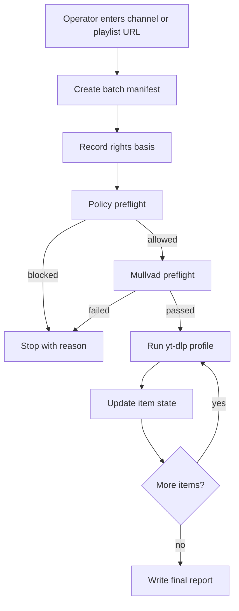

# Authorized Channel Archive Flow

```mermaid
flowchart TD
  A["Operator enters channel or playlist URL"] --> B["Create batch manifest"]
  B --> C["Record rights basis"]
  C --> D["Policy preflight"]
  D -->|blocked| E["Stop with reason"]
  D -->|allowed| F["Mullvad preflight"]
  F -->|failed| E
  F -->|passed| G["Run yt-dlp profile"]
  G --> H["Update item state"]
  H --> I{"More items?"}
  I -->|yes| G
  I -->|no| J["Write final report"]
```

## Required Evidence

- Rights basis.
- VPN preflight result.
- yt-dlp version.
- Output folder.
- Download archive file.
- Final report.

