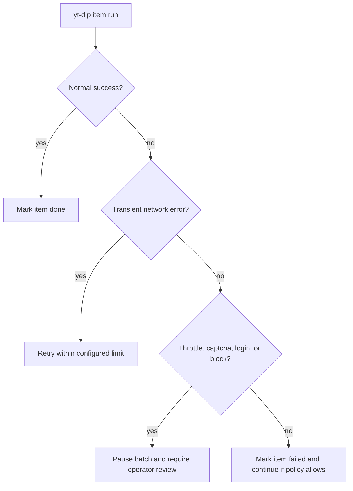

# Rate Limit and Block Handling Flow

## Policy

Relay changes are not an automatic recovery path for throttling, captchas, login prompts, or source-side blocks. The correct behavior is pause, report, and require operator review.

