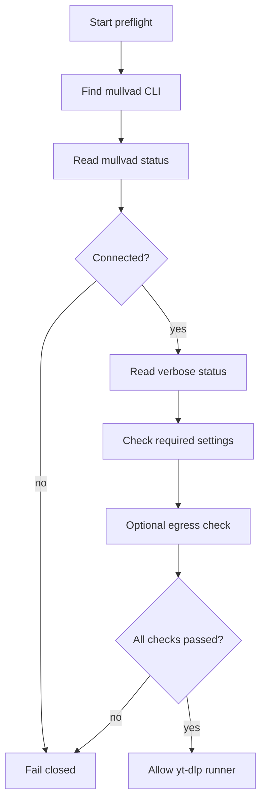

# VPN Connection Verification Flow

## Verification Notes

- Exact commands must be verified on the target Windows machine.
- Do not parse localized text if a structured output mode exists.
- Ambiguous output is a failed preflight.

