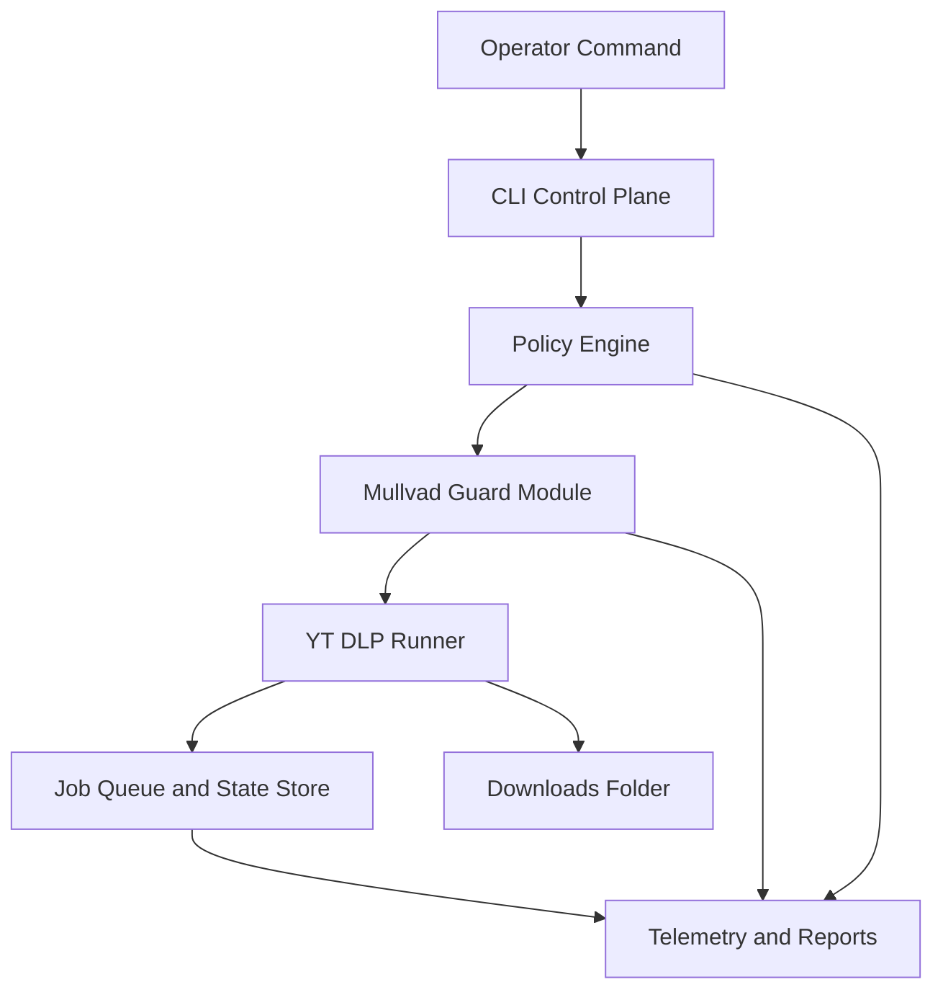

# Architecture Overview

The first implementation should be a Windows CLI app that coordinates existing tools and maintains state. Avoid GUI work until the core orchestration is proven.

## Components

- [[CLI Control Plane]] receives commands and renders operator output.
- [[Policy Engine]] checks rights basis, target allowlists, and stop conditions.
- [[Mullvad Guard Module]] verifies VPN and leak-prevention state before network work.
- [[YT DLP Runner]] owns process execution and yt-dlp config generation.
- [[Job Queue and State Store]] records batch state.
- [[Telemetry and Reports]] writes evidence and summaries.

## First Stack Guess

Use Python or Node for the first CLI. Python has strong process control and packaging options; Node has friendlier TUI/CLI libraries. Defer the decision until the repository scaffold starts and local runtime preferences are checked.

## Core Rule

The runner may start a download only after both [[Policy Engine]] and [[Mullvad Guard Module]] return a passing preflight.

